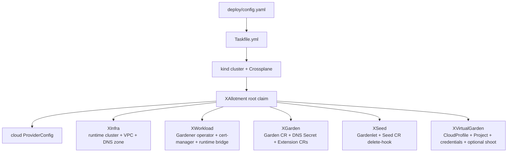
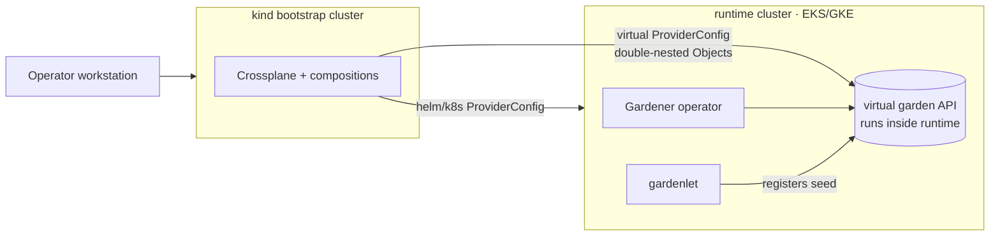

# Convergence model

*Why install is one apply-and-wait, and how the pieces fit together.*

A local kind cluster runs Crossplane, which provisions cloud infrastructure and
deploys [Gardener](https://gardener.cloud/docs/getting-started/architecture/)
through a single root composite (`XAllotment`) that composes five child XRs —
one per Gardener lifecycle concern. Creation **converges
naturally**: every child retries until its dependencies are ready, so the user
applies one resource and waits on one condition rather than orchestrating steps.

The user interacts with exactly one XR:

- `kubectl apply -f deploy/claims/<provider>/allotment.yaml` to install
- `kubectl delete xallotment/garden --cascade=foreground` to tear down (see
  [teardown ordering](teardown-ordering.md))

Implemented providers: **GCP** (GKE + Cloud DNS) and **AWS** (EKS + Route 53).

## The composite tree

The six XRDs live in `platform/definitions.yaml`. What each child contains is in
the [resource reference](../reference/resources.md).

## Cluster topology

Three control planes are involved. The kind cluster is the only thing the
operator's workstation talks to directly; it reaches the runtime and virtual
garden APIs through Crossplane ProviderConfigs, and virtual-garden resources are
[double-nested](double-nesting.md) Objects.

## Configuration flows from one file

`deploy/config.yaml` is an `EnvironmentConfig` and the single user-editable file.
Three EnvironmentConfigs drive the platform, loaded by every composition pipeline
via `function-environment-configs`:

| Resource | Name | Contents |
|---|---|---|
| Deployment config | `allotment-config` | Provider, project, region, zones, cluster name, DNS domain, shoot toggle |
| Shared versions | `allotment-versions` | Gardener core, extensions, cert-manager, Kubernetes version |
| Provider versions | `allotment-versions-{provider}` | Cloud extension version, Crossplane-on-runtime version |

Compositions load all three in their `load-versions` step, making settings and
versions available to patches and go-templates. The full field list is in the
[config reference](../reference/config.md).

All compositions are per-provider; claims select one with
`compositionSelector.matchLabels.provider` (`aws` or `gcp`). The Taskfile derives
`PROVIDER` from `deploy/config.yaml` and dispatches provider-specific identity
tasks — see the [task reference](../reference/task-targets.md).

## Install sequence

`task install` runs:

1. Create kind cluster from `kind.yaml`.
2. Apply `bootstrap/crossplane.yaml` (Crossplane Helm chart).
3. `task load-identity` once the Crossplane namespace exists — create credential
   secrets (the only unavoidable imperative step).
4. Apply `bootstrap/providers-common.yaml` + `bootstrap/providers-<provider>.yaml`;
   wait for providers healthy.
5. Apply `platform/definitions.yaml`, `platform/functions.yaml`,
   `platform/configs/`, `deploy/config.yaml`, and
   `platform/compositions/<provider>/`.
6. Wait for the `xallotments.allotment.io` CRD to be Established.
7. Apply `deploy/claims/<provider>/allotment.yaml` — one XAllotment claim.
8. `kubectl wait --for=condition=Ready xallotment/garden --timeout=40m` —
   Crossplane converges everything in one step.

`XGarden`'s Ready condition reflects the Garden CR's `lastOperation.state`
(`Succeeded`). Operational health still needs the Garden status conditions, since
post-ready component pressure can make a previously-succeeded Garden unhealthy —
[`task observability`](../how-to/troubleshoot-and-recover.md) surfaces these.
