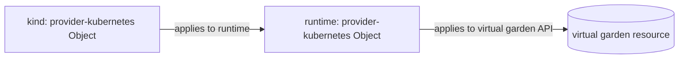

# Double-nested Objects

*Why virtual-garden resources are an Object inside an Object.*

The Gardener virtual garden API server runs **inside** the runtime cluster
(EKS/GKE) and is not reachable from the local kind control plane. Yet most
Gardener tenant resources — CloudProfile, Project, credentials, the optional
shoot — must be created against that virtual garden API.

Allotment bridges this with **double-nesting**: each virtual-garden resource is
an Object-in-Object.

1. The kind cluster creates a `kubernetes.crossplane.io` Object on the **runtime**
   cluster (via the `runtime` ProviderConfig).
2. That Object's manifest is *itself* a `kubernetes.crossplane.io` Object,
   configured with the `virtual` ProviderConfig, which the runtime's
   provider-kubernetes applies against the **virtual garden API**.

The bridge is the `gardener` kubeconfig secret published by the Gardener
operator; XWorkload wires it into the `runtime-providerconfig-virtual`
ProviderConfig.

## Consequences

- The kind cluster never needs network access to the virtual garden — everything
  flows through the runtime cluster's Crossplane bridge.
- Readiness has to be threaded from the inner Object up to the outer wrapper, so
  the bootstrap wrapper's readiness follows the real resource's readiness.
- Teardown of these Objects interacts with the
  [orphan/delete policies](teardown-ordering.md#why-some-resources-are-orphaned-not-deleted):
  the inner Object MR is removed from the runtime so it cannot pin the `virtual`
  ProviderConfig, while the underlying resource dies with the virtual garden etcd.

Which resources use this pattern is listed in the
[resource reference](../reference/resources.md#virtual-garden-virtual-provider).
