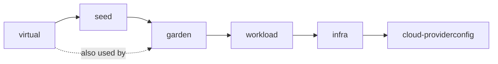

# Teardown ordering

*Why one delete tears everything down in the right order.*

```
task teardown  ≡  kubectl delete xallotment/garden --cascade=foreground
```

One command. Six composed `protection.crossplane.io/ClusterUsage` resources form
a chain enforced at the Kubernetes admission-webhook layer
(`nousages.protection.crossplane.io`). Each `ClusterUsage` blocks the `of`
resource's deletion until the `by` resource is gone, so deletion runs in reverse
lifecycle order:



Read each edge as *"delete the source before the target"* - the `ClusterUsage`
keeps the target alive until the source is gone. `seed` deletes before `garden`
so XSeed's `seed-cr` Object can trigger the gardenlet drain while the virtual
garden API is still reachable; `garden` is also held by `virtual` directly.

`function-sequencer` is **not** used for ordering here. It works for composed
managed resources (as in `infra` and `virtual`) but fails to re-evaluate after
its initial filtering when applied to composed XRs, permanently excluding
downstream XRs from the desired state. ClusterUsages are the only ordering
mechanism at the XAllotment layer.

## Why this order

1. **Shoots (virtual)**: delete XVirtualGarden. Shoots are removed by
   [gardenlet](https://gardener.cloud/docs/gardener/concepts/gardenlet/) while
   everything below them is still alive.
2. **Gardenlet (seed)**: delete XSeed. Its `seed-cr` Object deletion triggers
   gardenlet's drain of seed-class
   [`ManagedResource`s](https://gardener.cloud/docs/gardener/concepts/resource-manager/)
   on the runtime cluster while the virtual garden API is still reachable;
   gardenlet then deregisters itself.
3. **Garden**: delete XGarden. The
   [Gardener operator](https://gardener.cloud/docs/gardener/concepts/operator/)
   runs its own deletion DAG
   (~45 tasks). Because the seed drain has already run, the "no ManagedResources
   exist" check passes immediately; the DAG then tears down DNSRecords (extensions
   still registered), nginx-ingress, Istio, etcd, the virtual garden API, etc.
4. **Operator + bridge (workload)**: delete XWorkload. Operator, cert-manager,
   credentials, and the runtime bridge are removed. The Extension CRs (composed
   inside XGarden) were orphan-released already when XGarden tore down.
5. **Infrastructure (infra)**: delete XInfra. Cloud resources (VPC, EKS/GKE,
   IAM, DNS zone) are deleted. Orphaned Extension CRs die with the runtime
   control plane.
6. **Cloud ProviderConfig**: deleted last; every prior managed resource needed
   it to confirm its own deletion.

Deletion propagates through `ownerReferences` from XAllotment down to every
managed resource. The six ClusterUsages are owned by XAllotment too, so they
cascade-delete alongside the child XRs - but their finalizer keeps them alive
(and blocking) until each `by` resource has fully garbage-collected, at which
point the corresponding `of` resource's foreground-pending delete proceeds.

## The seed deregistration guard

The Seed and gardenlet live in their own composition specifically so the gardenlet
can deregister cleanly: it needs the virtual garden API alive to clean its
ManagedResources. Inside XSeed teardown:

- The `allow-seed-registration` marker ConfigMap and the Gardenlet CR delete
  immediately (deleting the Gardenlet CR is an upstream no-op).
- The `seed-cr` deletion drives gardenlet's drain.
- Once the Seed is gone, a `ClusterUsage` releases the gardenlet Deployment delete.

A gardenlet container restarted *after* the drain is denied Seed re-creation by
the `seed-registration-permit` ValidatingAdmissionPolicy (composed in XGarden),
because the marker ConfigMap no longer exists. gardenlet's `registerSeed` runs
unconditionally at every container start, so without this admission guard a
restart would re-register the Seed within seconds and orphan seed-class
ManagedResources that permanently block Garden's deletion DAG. The resulting
brief gardenlet `CrashLoopBackOff` during teardown is expected - see
[troubleshoot-and-recover](../how-to/troubleshoot-and-recover.md).

## Why some resources are orphaned, not deleted

Several resources are created *through* a ProviderConfig that may be torn down
before them, which would deadlock finalization. The Extension CRs and ENIConfigs
use `deletionPolicy: Orphan`; the virtual-garden credential Secrets use outer
`Delete` + inner `Orphan`. The orphaned objects are swept when the underlying
cluster or virtual-garden etcd is destroyed, so nothing leaks in the cloud.
